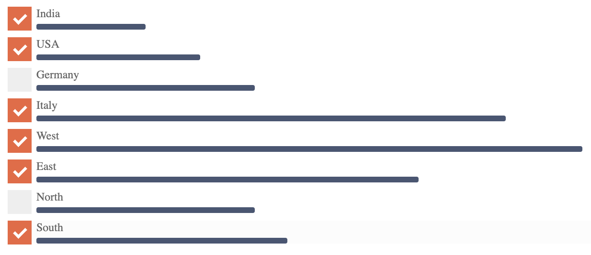

# Angular Filter Card
Filter card is useful in implementing a search results sidebar filter. 

```bash
git clone https://github.com/arunkumarv/filter-card.git
ng serve
```
```javascript
  data = [
    { value: 10, name:'India', checked: true },
    { value: 15, name:'USA', checked: true },
    { value: 20, name:'Germany', checked: false },
    { value: 43, name:'Italy', checked: true },
  ];
  
  checkboxToggled ( event ){
    // This will print an array of the checked names
    console.log ( event );
  }
```
```html
<filter-card 
  [data]="data" 
  (toggled)="checkboxToggled ($event)">
</filter-card>
```

Compiled using Angular 8.3.22.

## To do
- Normalise the data values to prevent overflow and make it easy to customise. 


